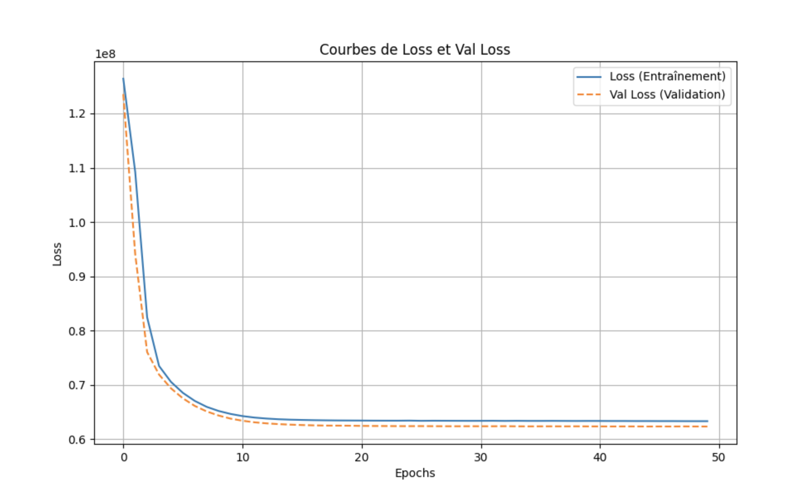

# Exposer une base de données relationnelle via une API REST et entrainer un modèle d'IA

## Démarrer

### Mise en place

```bash
python -m venv .venv

source .venv/bin/activate

pip install -r requirements.txt
```

## Initialiser la BDD et effectuer les migrations

```bash
alembic upgrade head
```

## Entraîner le modèle

```bash
python train.py
```

Tous les entraînements sont enregistrés dans MLFlow.

## Lancer le serveur HTTP

```bash
uvicorn main:server --host 0.0.0.0 --port 80
```

## Lancer l'interface MLFlow

```bash
mlflow ui --port 5000
```

## Structure du projet

- **initialize_db.py :** Permet d'initialiser la base de données en la remplissant avec les éléments du dataset nettoyé
- **server.py :** Gère la connexion à la base de données
- **main.py :** Programme principal, gère le serveur HTTP
- **/data :** Contient les corpus de données au format CSV
- **/models :** Contient les modèles et préprocesseurs générés
- **/alembic/versions :** Contient les scripts de migration
- **/domain :** Contient les processus métiers de l'API regroupés en "tranches verticales"
  - **/nom_entitee**
    - **nom_entite.py :** Classe représentant l'entité telle qu'elle existe dans la BDD
    - **api.py :** Ensemble des routes d'API permettant d'agir sur l'entité
    - **/templates :** Ensemble des fichiers HTML servant aux rendus des routes de l'API

## Routes de l'API

- **GET /documentation :** Documentation ReDoc
- **GET /loans :** Lister les emprunts du jeu de données
- **GET /loans/add :** Afficher le formulaire permettant d'ajouter un emprunt au jeu de données
- **POST /loans/add :** Ajouter un emprunt au jeu de données
- **DELETE /loans/:id :** Supprimer un emprunt du jeu de données
- **GET /loans/predict :** Afficher le formulaire permettant de prédire le montant d'un emprunt
- **POST /loans/predict :** Prédire le montant d'un emprunt

## Entraînement du modèle



## Migration

Le nouveau dataset, en plus de contenir de nouvelles lignes à intégrer, contient de nouvelles colonnes : `orientation_sexuelle`, `nb_enfants` et `quotient_caf`.

Sur ces 3 colonnes, nous ne garderons pas `orientation_sexuelle` : nous n'avons pas besoin de cette information, et elle pourrait causer des comportements discriminatoires chez notre modèle.

Certaines lignes n'ont pas de valeur définie pour la colonne `situation_familiale`. Nous allons les retirer.

Le script correspondant à cette migration peut être retrouvé fans le fichier `/alembic/versions/bd27d7e1c84d_new_dataset_inclusion.py`
